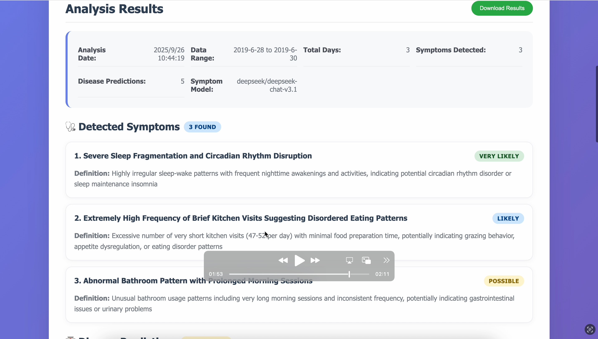
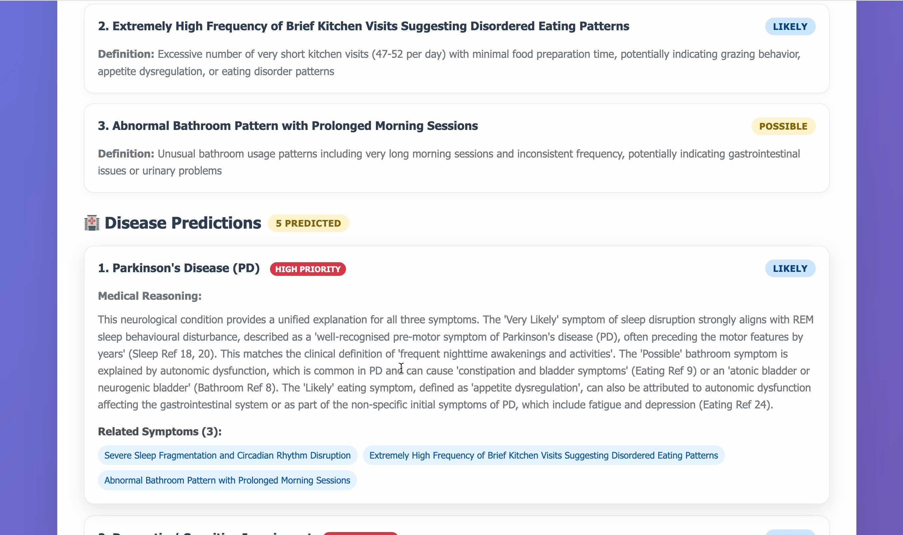

# 基于患者室内定位信息的 RAG 辅助疾病预测系统
# (RAG-based Disease Prediction Based on Patient Indoor Location)

项目主要探索在智慧医疗（Smart Healthcare）场景下，如何利用患者在医院内部的**空间定位轨迹（Indoor Location）**，结合**大语言模型（LLMs）**与**检索增强生成（RAG, Retrieval-Augmented Generation）**技术，实现对患者潜在疾病的智能化辅助预测。

---

## 📑 目录
- [🌟 项目背景与动机](#-项目背景与动机)
- [⚙️ 系统工作原理](#️-系统工作原理)
- [📂 详细目录结构](#-详细目录结构)
- [🚀 快速开始](#-快速开始)
- [💻 API 接口说明](#-api-接口说明)
- [📊 演示与可视化](#-演示与可视化)
- [🔮 局限性与未来工作](#-局限性与未来工作)

---

## 🌟 项目背景与动机

传统的疾病预测主要依赖患者的电子病历（EMR）或生理指标数据。然而，患者在医院内的**行为轨迹**（例如：在呼吸科候诊室停留 2 小时、频繁进出洗手间、在放射科进行检查等）同样蕴含着丰富的健康状态信息。

本项目创新性地将**空间行为语义化**，并通过 RAG 技术引入权威医学知识库，解决大语言模型在医疗垂直领域容易产生"幻觉"的问题，从而为临床分诊和早期疾病筛查提供具有可解释性的辅助参考。

---

## ⚙️ 系统工作原理

系统的核心工作流包含四大模块：

1. **轨迹语义化 (Trajectory to Semantic)**:
   - 接收患者的原始室内定位坐标及时间戳（`inputdata`）。
   - 通过 `raw2abtemplate.py` 将离散的物理坐标转化为连续的就医行为模板（如："患者A于上午9点在心血管内科停留40分钟"）。

2. **知识库向量化 (Knowledge Embedding)**:
   - 读取 `rag-info` 中的医学文献、疾病指南等文档。
   - 使用 `auto_embed.py` 进行文本分块（Chunking）与向量嵌入（Embedding），并持久化存储至本地向量库。

3. **检索增强推理 (RAG Engine)**:
   - 核心逻辑位于 `ab2diseasejudge.py`。
   - 提取患者行为特征后，系统在向量库中检索高度相关的医学背景知识。
   - 将"患者行为轨迹"与"检索到的医学知识"组合成 Prompt，交由 LLM 进行推理，输出预测的疾病概率及诊断依据。

4. **全栈交互 (Web Service)**:
   - 前端 (`index.html`) 提供直观的用户界面，展示预测结果。
   - 后端 (`server.py`) 提供稳定的 API 服务。

---

## 📂 详细目录结构

```text
📦 RAG-based-disease-prediction
 ┣ 📂 inputdata/          # 存放输入的原始定位数据（如 CSV/JSON 格式的轨迹日志）
 ┣ 📂 ouputdata/          # 系统自动生成的诊断预测报告与中间日志文件
 ┣ 📂 rag-info/           # 外部医学知识库原始文档（TXT, Markdown 或 PDF）
 ┣ 📜 ab2diseasejudge.py  # 核心推理引擎：结合行为轨迹与 RAG 结果调用大模型进行疾病推断
 ┣ 📜 auto_embed.py       # 向量化脚本：负责处理 rag-info 并生成向量数据库
 ┣ 📜 raw2abtemplate.py   # 数据预处理：将原始物理坐标解析为结构化/语义化的行为描述
 ┣ 📜 embedded_docs.json  # 序列化后的本地向量索引库（由 auto_embed.py 生成）
 ┣ 📜 config.json         # 项目全局配置文件（存放模型 API Key、数据库路径、超参数等）
 ┣ 📜 server.py           # 后端核心应用服务
 ┣ 📜 start_server.py     # 快速启动脚本（包装了环境检查与服务启动逻辑）
 ┣ 📜 client.py           # 测试客户端脚本：用于模拟发送患者数据并接收预测结果
 ┣ 📜 index.html          # Web 前端页面：提供数据上传、轨迹可视化及报告展示界面
 ┗ 📜 requirements.txt    # Python 依赖包列表
```

---

## 🚀 快速开始

### 1. 环境准备

建议使用 Python 3.8 或以上版本，并使用虚拟环境进行隔离：

```bash
# 克隆项目到本地
git clone https://github.com/julianhujr/RAG-based-disease-prediction-based-on-patient-indoor-location.git
cd RAG-based-disease-prediction-based-on-patient-indoor-location

# 安装所需依赖
pip install -r requirements.txt
```

### 2. 配置参数

在根目录下找到或创建 `config.json` 文件，填入你的大语言模型 API 密钥（如 OpenAI API Key 或本地部署的模型地址），并配置相关路径：

```json
{
  "llm_api_key": "your-api-key-here",
  "embedding_model": "text-embedding-ada-002",
  "data_paths": {
    "input": "./inputdata",
    "output": "./ouputdata"
  }
}
```

### 3. 构建医学知识库

将相关的医学文本资料（如 PDF、TXT 或 Markdown）放入 `rag-info` 文件夹中，然后运行嵌入脚本将知识库向量化：

```bash
python auto_embed.py
```

> 注：执行成功后，项目目录下会生成或更新 `embedded_docs.json` 索引文件。

### 4. 启动服务

运行启动脚本，开启后端 API 与 Web 静态服务：

```bash
python start_server.py
```

> 服务默认将在 `http://localhost:8080` 运行（具体端口请参考终端输出）。

### 5. 测试与使用

- **UI 界面测试**：浏览器打开 `http://localhost:8080` 或直接双击 `index.html`，上传 `inputdata` 中的示例数据进行可视化测试。
- **命令行测试**：新开一个终端窗口，运行以下命令模拟发送测试请求：

```bash
python client.py
```

---

## 💻 API 接口说明

系统后端提供标准的 RESTful API 供前端或第三方应用调用。

### 疾病预测接口

> **Endpoint:** `POST /api/predict`
>
> **Content-Type:** `application/json`
>
> **描述:** 接收患者的室内轨迹序列，结合 RAG 知识库返回疾病预测与诊断分析。

**Request Body 示例：**

```json
{
  "patient_id": "P_10042",
  "trajectory": [
    {
      "timestamp": "08:30:00",
      "zone": "Registration_Desk",
      "duration_mins": 10
    },
    {
      "timestamp": "08:45:00",
      "zone": "Cardiology_Waiting_Room",
      "duration_mins": 45
    },
    {
      "timestamp": "09:30:00",
      "zone": "ECG_Examination_Room",
      "duration_mins": 15
    }
  ]
}
```

**Response 示例：**

```json
{
  "status": "success",
  "data": {
    "patient_id": "P_10042",
    "predicted_disease": "Cardiovascular Anomaly (e.g., Arrhythmia)",
    "confidence_score": 0.85,
    "reasoning_process": "患者在心血管科候诊区停留时间较长（45分钟），随后直接前往心电图室（15分钟）。结合检索到的《心血管疾病就诊路径指南》，此类轨迹高度符合心律失常或疑似冠心病患者的标准检查流程。",
    "rag_references": [
      "文档A: 《心血管疾病就诊路径指南》第3章 - 典型检查路径",
      "文档B: 病例知识库 - 异常心电图排查流程"
    ]
  }
}
```

---

## 📊 演示与可视化

以下截图为系统实际运行效果展示。

**图 1：分析结果页面 — 症状检测与摘要信息**

展示系统对患者轨迹数据的分析摘要，包括数据时间范围、检测到的症状数量（3项）及疾病预测数量（5项）。检测到的症状包括：睡眠碎片化与昼夜节律紊乱（Very Likely）、厨房高频短暂访问提示饮食紊乱（Likely）、异常卫生间使用模式（Possible）。



---

**图 2：疾病预测结果 — 帕金森病（PD）高优先级推断**

展示系统基于 RAG 知识库的疾病推理输出。系统综合三项症状，将帕金森病（PD）列为首要预测疾病（HIGH PRIORITY / LIKELY），并给出详细的医学推理依据与文献引用。



---

## 🔮 局限性与未来工作

作为毕业设计项目，本系统搭建了一个完整的概念验证（PoC）原型，但在实际落地中仍有以下改进空间：

1. **室内定位精度**：目前系统依赖结构化的坐标输入，未来可考虑直接接入蓝牙信标（Beacon）、Wi-Fi 探针或 UWB 传感器的原始信号数据进行处理。
2. **多模态数据融合**：未来不仅可以使用位置数据，还可尝试融合患者的体温、心率等可穿戴设备的实时生理数据，以提高预测准确率。
3. **隐私与合规保护**：医疗轨迹属于高度敏感的个人数据，后续研究需引入联邦学习（Federated Learning）或数据脱敏算法，以符合医疗数据隐私保护标准。
